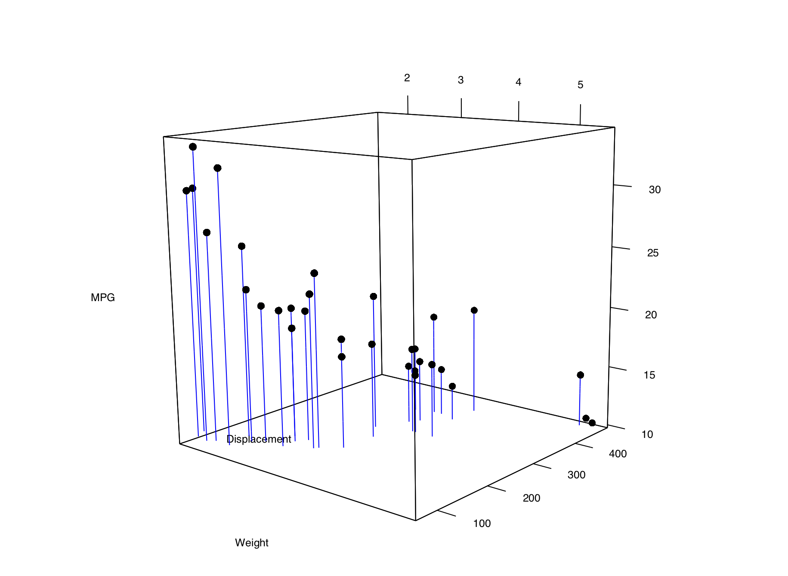
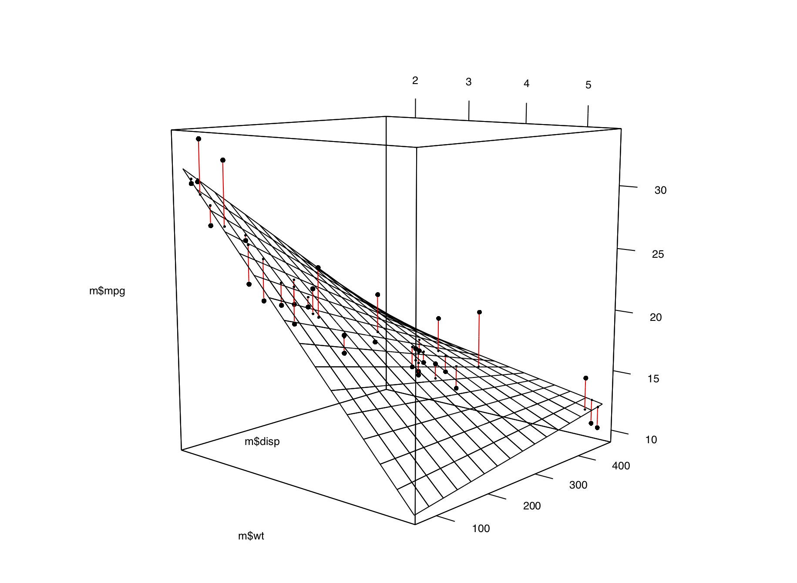

---
output:
  bookdown::html_document2:
    fig_caption: yes
editor_options:
  chunk_output_type: console
---

```{r echo = FALSE, cache = FALSE}
# This block needs cache=FALSE to set fig.width and fig.height, and have those
# persist across cached builds.

source("utils.R", local = TRUE)
knitr::opts_chunk$set(fig.width=3.5, fig.height=3.5)
```


Miscellaneous Graphs {#CHAPTER-MISCGRAPH}
====================

There are many, many ways of visualizing data, and sometimes things don't fit into nice, tidy categories. This chapter shows how to make some of these other visualizations.


Making a Correlation Matrix {#RECIPE-MISCGRAPH-CORRMATRIX}
---------------------------

### Problem

You want to make a graphical correlation matrix.

### Solution

We'll look at the `mtcars` data set:

```{r}
mtcars
```

First, generate the numerical correlation matrix using `cor`. This will generate correlation coefficients for each pair of columns:


```{r}
mcor <- cor(mtcars)
# Print mcor and round to 2 digits
round(mcor, digits = 2)
```

If there are any columns that you don't want used for correlations (for example, a column of names), you should exclude them. If there are any `NA` cells in the original data, the resulting correlation matrix will have `NA` values. To deal with this, you will probably want to use the argument `use="complete.obs"` or `use="pairwise.complete.obs"`.

To plot the correlation matrix (Figure \@ref(fig:FIG-MISCGRAPH-CORRMATRIX-BASIC)), we'll use the corrplot package:

```{r FIG-MISCGRAPH-CORRMATRIX-BASIC, fig.cap="A correlation matrix", fig.width=7, fig.height=7, message=FALSE}
# If needed, first install with install.packages("corrplot")
library(corrplot)

corrplot(mcor)
```

### Discussion

The `corrplot()` function has many, many options. Here is an example of how to make a correlation matrix with colored squares and black labels, rotated 45 degrees along the top (Figure \@ref(fig:FIG-MISCGRAPH-CORRMATRIX-SHADE)):

```{r FIG-MISCGRAPH-CORRMATRIX-SHADE, fig.cap="Correlation matrix with colored squares and black, rotated labels", fig.width=7, fig.height=7}
corrplot(mcor, method = "shade", shade.col = NA, tl.col = "black", tl.srt = 45)
```

It may also be helpful to display labels representing the correlation coefficient on each square in the matrix. In this example we'll make a lighter palette so that the text is readable, and we'll remove the color legend, since it's redundant. We'll also order the items so that correlated items are closer together, using the `order="AOE"` (angular order of eigenvectors) option. The result is shown in Figure \@ref(fig:FIG-MISCGRAPH-CORRMATRIX-SHADE-NUM):

```{r FIG-MISCGRAPH-CORRMATRIX-SHADE-NUM, fig.cap="Correlation matrix with correlation coefficients and no legend", fig.width=7, fig.height=7}
# Generate a lighter palette
col <- colorRampPalette(c("#BB4444", "#EE9988", "#FFFFFF", "#77AADD", "#4477AA"))

corrplot(mcor, method = "shade", shade.col = NA, tl.col = "black", tl.srt = 45,
         col = col(200), addCoef.col = "black", cl.pos = "n", order = "AOE")
```


Like many other standalone plotting functions, `corrplot()` has its own menagerie of options, which can't all be illustrated here. Table \@ref(tab:TABLE-OPTIONS-FOR-CORRPLOT) lists some useful options.

Table: (\#tab:TABLE-OPTIONS-FOR-CORRPLOT) Options for `corrplot()`

+-----------------------------------+-----------------------------------+
| Option                            | Description                       |
+===================================+===================================+
| `type={"lower" | "upper"}`        | Only use the lower or upper       |
|                                   | triangle                          |
+-----------------------------------+-----------------------------------+
| `diag=FALSE`                      | Don't show values on the          |
|                                   | diagonal                          |
+-----------------------------------+-----------------------------------+
| `addshade="all"`                  | Add lines indicating the          |
|                                   | direction of the correlation      |
+-----------------------------------+-----------------------------------+
| `shade.col=NA`                    | Hide correlation direction lines  |
+-----------------------------------+-----------------------------------+
| `method="shade"`                  | Use colored squares               |
+-----------------------------------+-----------------------------------+
| `method="ellipse"`                | Use ellipses                      |
+-----------------------------------+-----------------------------------+
| `addCoef.col="*color*"`           | Add correlation coefficients, in  |
|                                   | *color*                           |
+-----------------------------------+-----------------------------------+
| `tl.srt="*number*"`               | Specify the rotation angle for    |
|                                   | top labels                        |
+-----------------------------------+-----------------------------------+
| `tl.col="*color*"`                | Specify the label color           |
+-----------------------------------+-----------------------------------+
| `order={"AOE" | "FPC" | "hclust"}`| Sort labels using angular order   |
|                                   | of eigenvectors, first principal  |
|                                   | component, or hierarchical        |
|                                   | clustering                        |
+-----------------------------------+-----------------------------------+


### See Also

To create a scatter plot matrix, see Recipe \@ref(RECIPE-SCATTER-SPLOM).

For more on subsetting data, see Recipe \@ref(RECIPE-DATAPREP-SUBSET).


Plotting a Function {#RECIPE-MISCGRAPH-FUNCTION}
-------------------

### Problem

You want to plot a function.

### Solution

Use `stat_function()`. It's also necessary to give ggplot a dummy data frame so that it will get the proper *x* range. In this example we'll use `dnorm()`, which gives the density of the normal distribution (Figure \@ref(fig:FIG-MISCGRAPH-FUNCTION), left):

```{r FIG-MISCGRAPH-FUNCTION-1, eval=FALSE}
# The data frame is only used for setting the range
p <- ggplot(data.frame(x = c(-3, 3)), aes(x = x))

p + stat_function(fun = dnorm)
```

### Discussion

Some functions take additional arguments. For example, `dt()`, the function for the density of the *t*-distribution, takes a parameter for degrees of freedom (Figure \@ref(fig:FIG-MISCGRAPH-FUNCTION), right). These additional arguments can be passed to the function by putting them in a list and giving the list to args:

```{r FIG-MISCGRAPH-FUNCTION-2, eval=FALSE}
p + stat_function(fun = dt, args = list(df = 2))
```

(ref:cap-FIG-MISCGRAPH-FUNCTION) The normal distribution (left); The *t*-distribution with `df=2` (right)

```{r FIG-MISCGRAPH-FUNCTION, ref.label=c("FIG-MISCGRAPH-FUNCTION-1", "FIG-MISCGRAPH-FUNCTION-2"), echo=FALSE, fig.show="hold", fig.cap="(ref:cap-FIG-MISCGRAPH-FUNCTION)"}
```

It's also possible to define your own functions. It should take an *x* value for its first argument, and it should return a *y* value. In this example, we'll define a sigmoid function (Figure \@ref(fig:FIG-MISCGRAPH-FUNCTION-CUSTOM)):

```{r FIG-MISCGRAPH-FUNCTION-CUSTOM, fig.cap="A user-defined function"}
myfun <- function(xvar) {
    1 / (1 + exp(-xvar + 10))
}

ggplot(data.frame(x = c(0, 20)), aes(x = x)) +
  stat_function(fun = myfun)
```

By default, the function is calculated at 101 points along the *x* range. If you have a rapidly fluctuating function, you may be able to see the individual segments. To smooth out the curve, pass a larger value of n to `stat_function()`, as in `stat_function(fun=myfun, n=200)`.

### See Also

For plotting predicted values from model objects (such as `lm` and `glm`), see Recipe \@ref(RECIPE-SCATTER-FITLINES-MODEL).


Shading a Subregion Under a Function Curve {#RECIPE-MISCGRAPH-FUNCTION-SHADE}
------------------------------------------

### Problem

You want to shade part of the area under a function curve.

### Solution

Define a new wrapper function around your curve function, and replace out-of-range values with `NA`, as shown in Figure \@ref(fig:FIG-MISCGRAPH-FUNCTION-SHADE):

```{r FIG-MISCGRAPH-FUNCTION-SHADE, fig.cap="Function curve with a shaded region"}
# Return dnorm(x) for 0 < x < 2, and NA for all other x
dnorm_limit <- function(x) {
    y <- dnorm(x)
    y[x < 0  |  x > 2] <- NA
    return(y)
}

# ggplot() with dummy data
p <- ggplot(data.frame(x = c(-3, 3)), aes(x = x))

p +
  stat_function(fun = dnorm_limit, geom = "area", fill = "blue", alpha = 0.2) +
  stat_function(fun = dnorm)
```

Remember that what gets passed to this function is a vector, not individual values. If this function operated on single elements at a time, it might make sense to use an `if`--`else` statement to decide what to return, conditional on the value of `x`. But that won't work here, since `x` is a vector with many values.

### Discussion

R has first-class functions, and we can write a function that returns a *closure*-that is, we can program a function to program another function.

This function will allow you to pass in a function, a minimum value, and a maximum value. Values outside the range will again be returned with `NA`:

```{r}
limitRange <- function(fun, min, max) {
  function(x) {
    y <- fun(x)
    y[x < min  |  x > max] <- NA
    return(y)
  }
}
```

Now we can call this function to create another function -- one that is effectively the same as the `dnorm_limit()` function used earlier:

```{r}
# This returns a function
dlimit <- limitRange(dnorm, 0, 2)
# Now we'll try out the new function -- it only returns values for inputs
# between 0 and 2
dlimit(-2:4)
```

We can use `limitRange()` to create a function that is passed to `stat_function()`:

```{r eval=FALSE}
p +
  stat_function(fun = dnorm) +
  stat_function(fun = limitRange(dnorm, 0, 2), geom = "area", fill = "blue",
                alpha = 0.2)
```

The `limitRange()` function can be used with any function, not just `dnorm()`, to create a range-limited version of that function. The result of all this is that instead of having to write functions with different hard-coded values for each situation that arises, we can write one function and simply pass it different arguments depending on the situation.

If you look very, very closely at the graph in Figure \@ref(fig:FIG-MISCGRAPH-FUNCTION-SHADE), you may see that the shaded region does not align exactly with the range we specified. This is because ggplot2 does a numeric approximation by calculating values at fixed intervals, and these intervals may not fall exactly within the specified range. As in Recipe \@ref(RECIPE-MISCGRAPH-FUNCTION), we can improve the approximation by increasing the number of interpolated values with `stat_function(n = 200)`.


Creating a Network Graph {#RECIPE-MISCGRAPH-GRAPH}
------------------------

### Problem

You want to create a network graph.

### Solution

Use the igraph package. To create a graph, pass a vector containing pairs of items to `graph()`, then plot the resulting object (Figure \@ref(fig:FIG-MISCGRAPH-GRAPH-BASIC)):

```{r FIG-MISCGRAPH-GRAPH-BASIC, fig.show="hold", fig.cap="A directed graph (left); An undirected graph, with no vertex labels (right)", fig.width=4.5, fig.height=4.5}
# May need to install first, with install.packages("igraph")
library(igraph)

# Specify edges for a directed graph
gd <- graph(c(1,2, 2,3, 2,4, 1,4, 5,5, 3,6))
plot(gd)

# For an undirected graph
gu <- graph(c(1,2, 2,3, 2,4, 1,4, 5,5, 3,6), directed = FALSE)
# No labels
plot(gu, vertex.label = NA)
```


This is the structure of each of the graph objects:

```{r}
gd
gu
```


### Discussion

In a network graph, the position of the nodes is unspecified by the data, and they're placed randomly. To make the output repeatable, you can set the random seed before making the plot. You can try different random numbers until you get a result that you like:

```{r eval=FALSE}
set.seed(229)
plot(gu)
```

It's also possible to create a graph from a data frame. The first two columns of the data frame are used, and each row specifies a connection between two nodes. In the next example (Figure \@ref(fig:FIG-MISCGRAPH-GRAPH-DIRECTED)), we'll use the `madmen2` data set, which has this structure. We'll also use the Fruchterman-Reingold layout algorithm. The idea is that all the nodes have a magnetic repulsion from one another, but the edges between nodes act as springs, pulling the nodes together:

```{r FIG-MISCGRAPH-GRAPH-DIRECTED, fig.cap="A directed graph from a data frame, with the Fruchterman-Reingold algorithm", fig.width=5, fig.height=5}
library(gcookbook) # For the data set
madmen2
# Create a graph object from the data set
g <- graph.data.frame(madmen2, directed=TRUE)
# Remove unnecessary margins
par(mar = c(0, 0, 0, 0))
plot(g, layout = layout.fruchterman.reingold, vertex.size = 8,
     edge.arrow.size = 0.5, vertex.label = NA)
```

It's also possible to make a directed graph from a data frame. The `madmen` data set has only one row for each pairing, since direction doesn't matter for an undirected graph. This time we'll use a circle layout (Figure \@ref(fig:FIG-MISCGRAPH-GRAPH-CIRCLE)):

```{r FIG-MISCGRAPH-GRAPH-CIRCLE, fig.cap="A circular undirected graph from a data frame"}
g <- graph.data.frame(madmen, directed = FALSE)
par(mar = c(0, 0, 0, 0))  # Remove unnecessary margins
plot(g, layout = layout.circle, vertex.size = 8, vertex.label = NA)
```


### See Also

For more information about the available output options, see `?plot.igraph`. Also see `?igraph::layout` for layout options.

An alternative to igraph is Rgraphviz, which a frontend for Graphviz, an open-source library for visualizing graphs. It works better with labels and makes it easier to create graphs with a controlled layout, but it can be a bit challenging to install. Rgraphviz is available through the Bioconductor repository system.


Using Text Labels in a Network Graph {#RECIPE-MISCGRAPH-GRAPH-LABEL}
------------------------------------

### Problem

You want to use text labels in a network graph.

### Solution

The vertices/nodes may have names, but these names are not used as labels by default. To set the labels, pass in a vector of names to `vertex.label` (Figure \@ref(fig:FIG-MISCGRAPH-GRAPH-LABEL)):

```{r FIG-MISCGRAPH-GRAPH-LABEL, fig.cap="A network graph with labels", fig.width=6, fig.height=6}
library(igraph)
library(gcookbook) # For the data set

# Copy madmen and drop every other row
m <- madmen[1:nrow(madmen) %% 2 == 1, ]

g <- graph.data.frame(m, directed=FALSE) # Print out the names of each vertex

V(g)$name

plot(g, layout=layout.fruchterman.reingold,
    vertex.size = 4,          # Smaller nodes
    vertex.label = V(g)$name, # Set the labels
    vertex.label.cex = 0.8,   # Slightly smaller font
    vertex.label.dist = 0.4,  # Offset the labels
    vertex.label.color = "black")
```

### Discussion

Another way to achieve the same effect is to modify the plot object, instead of passing in the values as arguments to `plot()`. To do this, use `V()$xxx<-` instead of passing a value to a `vertex.xxx` argument. For example, this will result in the same output as the previous code:

```{r, eval=FALSE}
# This is equivalent to the preceding code
V(g)$size        <- 4
V(g)$label       <- V(g)$name
V(g)$label.cex   <- 0.8
V(g)$label.dist  <- 0.4
V(g)$label.color <- "black"

# Set a property of the entire graph
g$layout <- layout.fruchterman.reingold

plot(g)
```

The properties of the edges can also be set, either with the `E()` function or by passing values to `edge.xxx` arguments (Figure \@ref(fig:FIG-MISCGRAPH-GRAPH-LABEL-EDGE)):

```{r echo=FALSE}
# This block duplicates the settings above; they get consumed when plot() is
# called, but we want them to apply to the next block.
V(g)$size        <- 4
V(g)$label       <- V(g)$name
V(g)$label.cex   <- 0.8
V(g)$label.dist  <- 0.4
V(g)$label.color <- "black"

# Set a property of the entire graph
g$layout <- layout.fruchterman.reingold
```

```{r FIG-MISCGRAPH-GRAPH-LABEL-EDGE, fig.cap="A network graph with labeled and colored edges", fig.width=6, fig.height=6}
# View the edges
E(g)

# Set some of the labels to "M"
E(g)[c(2,11,19)]$label <- "M"

# Set color of all to grey, and then color a few red
E(g)$color             <- "grey70"
E(g)[c(2,11,19)]$color <- "red"

plot(g)
```

### See Also

See `?igraph.plotting` for more information about graphical parameters in igraph.


Creating a Heat Map {#RECIPE-MISCGRAPH-HEATMAP}
-------------------

### Problem

You want to make a heat map.

### Solution

Use `geom_tile()` or `geom_raster()` and map a continuous variable to `fill`. We'll use the `presidents` data set, which is a time series object rather than a data frame:

```{r}
presidents
str(presidents)
```

We'll first convert it to a format that is usable by ggplot: a data frame with columns that are numeric:

```{r}
pres_rating <- data.frame(
  rating = as.numeric(presidents),
  year = as.numeric(floor(time(presidents))),
  quarter = as.numeric(cycle(presidents))
)
pres_rating
```

Now we can make the plot using `geom_tile()` or `geom_raster()` (Figure \@ref(fig:FIG-MISCGRAPH-HEATMAP)). Simply map one variable to `x`, one to `y`, and one to `fill`:

```{r eval=FALSE}
# Base plot
p <- ggplot(pres_rating, aes(x = year, y = quarter, fill = rating))

# Using geom_tile()
p + geom_tile()

# Using geom_raster() - looks the same, but a little more efficient
p + geom_raster()
```

(ref:cap-FIG-MISCGRAPH-HEATMAP) A heat map-the grey squares represent `NA`s in the data

```{r FIG-MISCGRAPH-HEATMAP, echo=FALSE, fig.cap="(ref:cap-FIG-MISCGRAPH-HEATMAP)", fig.width=13, fig.height=2}
# The above code block is just for display because it would make two plots when
# we just need one.
p <- ggplot(pres_rating, aes(x = year, y = quarter, fill = rating))
p +
  geom_tile()
```

> **Note**
>
> The results with `geom_tile()` and `geom_raster()` *should* look the same, but in practice they might appear different. See Recipe \@ref(RECIPE-DISTRIBUTION-DENSITY2D) for more information about this issue.

### Discussion

To better convey useful information, you may want to customize the appearance of the heat map. With this example, we'll reverse the y-axis so that it progresses from top to bottom, and we'll add tick marks every four years along the x-axis, to correspond with each presidential term. For the x and y scales, we remove the padding by using `expand=c(0, 0)`.  We'll also change the color scale using `scale_fill_gradient2()`, which lets you specify a midpoint color and the two colors at the low and high ends (Figure \@ref(fig:FIG-MISCGRAPH-HEATMAP-CUSTOM)):

```{r FIG-MISCGRAPH-HEATMAP-CUSTOM, fig.cap="A heat map with customized appearance", fig.width=13, fig.height=2}
p +
  geom_tile() +
  scale_x_continuous(breaks = seq(1940, 1976, by = 4), expand = c(0, 0)) +
  scale_y_reverse(expand = c(0, 0)) +
  scale_fill_gradient2(midpoint = 50, mid = "grey70", limits = c(0, 100))
```

### See Also

If you want to use a different color palette, see Recipe \@ref(RECIPE-COLORS-PALETTE-CONTINUOUS).


Creating a Three-Dimensional Scatter Plot {#RECIPE-MISCGRAPH-3D-SCATTER}
-----------------------------------------

### Problem

You want to create a three-dimensional scatter plot.

### Solution

We'll use the rgl package, which provides an interface to the OpenGL graphics library for 3D graphics. To create a 3D scatter plot, as in Figure \@ref(fig:FIG-MISCGRAPH-3D-SCATTER), use `plot3d()` and pass in a data frame where the first three columns represent *x*, *y*, and *z* coordinates, or pass in three vectors representing the *x*, *y*, and *z* coordinates.

```{r eval=FALSE}
# You may need to install first, with install.packages("rgl")
library(rgl)
plot3d(mtcars$wt, mtcars$disp, mtcars$mpg, type = "s", size = 0.75, lit = FALSE)
```

```{r FIG-MISCGRAPH-3D-SCATTER, echo=FALSE, fig.cap="A 3D scatter plot"}
knitr::include_graphics("fig/FIG-MISCGRAPH-3D-SCATTER.png")
```

> **Note**
>
> If you are using a Mac, you will need to install XQuartz before you can use rgl. You can download it from <https://www.xquartz.org/>.

Viewers can rotate the image by clicking and dragging with the mouse, and zoom in and out with the scroll wheel.

> **Note**
>
> By default, `plot3d()` uses square points, which do not appear properly when saving to a PDF. For improved appearance, the example above uses `type="s"` for spherical points, made them smaller with `size=0.75`, and turned off the 3D lighting with `lit=FALSE` (otherwise they look like shiny spheres).

### Discussion

Three-dimensional scatter plots can be difficult to interpret, so it's often better to use a two-dimensional representation of the data. That said, there are things that can help make a 3D scatter plot easier to understand.

In Figure \@ref(fig:FIG-MISCGRAPH-3D-SCATTER2), we'll add vertical segments to help give a sense of the spatial positions of the points:

```{r eval=FALSE}
# Function to interleave the elements of two vectors
interleave <- function(v1, v2)  as.vector(rbind(v1,v2))

# Plot the points
plot3d(mtcars$wt, mtcars$disp, mtcars$mpg,
       xlab = "Weight", ylab = "Displacement", zlab = "MPG",
       size = .75, type = "s", lit = FALSE)

# Add the segments
segments3d(interleave(mtcars$wt,   mtcars$wt),
           interleave(mtcars$disp, mtcars$disp),
           interleave(mtcars$mpg,  min(mtcars$mpg)),
           alpha = 0.4, col = "blue")
```


```{r FIG-MISCGRAPH-3D-SCATTER2, echo=FALSE, fig.cap="A 3D scatter plot with vertical lines for each point"}

```

It's possible to tweak the appearance of the background and the axes. In Figure \@ref(fig:FIG-MISCGRAPH-3D-SCATTER3), we change the number of tick marks and add tick marks and axis labels to the specified sides:

```{r eval=FALSE}
# Make plot without axis ticks or labels
plot3d(mtcars$wt, mtcars$disp, mtcars$mpg,
       xlab = "", ylab = "", zlab = "",
       axes = FALSE,
       size = .75, type = "s", lit = FALSE)

segments3d(interleave(mtcars$wt,   mtcars$wt),
           interleave(mtcars$disp, mtcars$disp),
           interleave(mtcars$mpg,  min(mtcars$mpg)),
           alpha = 0.4, col = "blue")

# Draw the box.
rgl.bbox(color = "grey50",          # grey60 surface and black text
         emission = "grey50",       # emission color is grey50
         xlen = 0, ylen = 0, zlen = 0)  # Don't add tick marks

# Set default color of future objects to black
rgl.material(color = "black")

# Add axes to specific sides. Possible values are "x--", "x-+", "x+-", and "x++".
axes3d(edges = c("x--", "y+-", "z--"),
       ntick = 6,                       # Attempt 6 tick marks on each side
       cex = .75)                       # Smaller font

# Add axis labels. 'line' specifies how far to set the label from the axis.
mtext3d("Weight",       edge = "x--", line = 2)
mtext3d("Displacement", edge = "y+-", line = 3)
mtext3d("MPG",          edge = "z--", line = 3)
```

```{r FIG-MISCGRAPH-3D-SCATTER3, echo=FALSE, fig.show="hold", fig.cap="3D scatter plot with axis ticks and labels repositioned"}
knitr::include_graphics("fig/FIG-MISCGRAPH-3D-SCATTER3.png")
```


### See Also

See `?plot3d` for more options for controlling the output.


Adding a Prediction Surface to a Three-Dimensional Plot {#RECIPE-MISCGRAPH-3D-SCATTER-MODEL}
-------------------------------------------------------

### Problem

You want to add a surface of predicted value to a three-dimensional scatter plot.

### Solution

First we need to define some utility functions for generating the predicted values from a model object:

```{r eval=FALSE}
# Given a model, predict zvar from xvar and yvar
# Defaults to range of x and y variables, and a 16x16 grid
predictgrid <- function(model, xvar, yvar, zvar, res = 16, type = NULL) {
  # Find the range of the predictor variable. This works for lm and glm
  # and some others, but may require customization for others.
  xrange <- range(model$model[[xvar]])
  yrange <- range(model$model[[yvar]])

  newdata <- expand.grid(x = seq(xrange[1], xrange[2], length.out = res),
                         y = seq(yrange[1], yrange[2], length.out = res))
  names(newdata) <- c(xvar, yvar)
  newdata[[zvar]] <- predict(model, newdata = newdata, type = type)
  newdata
}


# Convert long-style data frame with x, y, and z vars into a list
# with x and y as row/column values, and z as a matrix.
df2mat <- function(p, xvar = NULL, yvar = NULL, zvar = NULL) {
  if (is.null(xvar)) xvar <- names(p)[1]
  if (is.null(yvar)) yvar <- names(p)[2]
  if (is.null(zvar)) zvar <- names(p)[3]

  x <- unique(p[[xvar]])
  y <- unique(p[[yvar]])
  z <- matrix(p[[zvar]], nrow = length(y), ncol = length(x))

  m <- list(x, y, z)
  names(m) <- c(xvar, yvar, zvar)
  m
}

# Function to interleave the elements of two vectors
interleave <- function(v1, v2)  as.vector(rbind(v1,v2))
```

With these utility functions defined, we can make a linear model from the data and plot it as a mesh along with the data, using the `surface3d()` function, as shown in Figure \@ref(fig:FIG-MISCGRAPH-3D-SCATTER-MODEL):

```{r eval=FALSE}
library(rgl)

# Make a copy of the data set
m <- mtcars

# Generate a linear model
mod <- lm(mpg ~ wt + disp + wt:disp, data = m)

# Get predicted values of mpg from wt and disp
m$pred_mpg <- predict(mod)

# Get predicted mpg from a grid of wt and disp
mpgrid_df <- predictgrid(mod, "wt", "disp", "mpg")
mpgrid_list <- df2mat(mpgrid_df)

# Make the plot with the data points
plot3d(m$wt, m$disp, m$mpg, type = "s", size = 0.5, lit = FALSE)

# Add the corresponding predicted points (smaller)
spheres3d(m$wt, m$disp, m$pred_mpg, alpha = 0.4, type = "s", size = 0.5, lit = FALSE)

# Add line segments showing the error
segments3d(interleave(m$wt,   m$wt),
           interleave(m$disp, m$disp),
           interleave(m$mpg,  m$pred_mpg),
           alpha = 0.4, col = "red")

# Add the mesh of predicted values
surface3d(mpgrid_list$wt, mpgrid_list$disp, mpgrid_list$mpg,
          alpha = 0.4, front = "lines", back = "lines")
```

```{r FIG-MISCGRAPH-3D-SCATTER-MODEL, echo=FALSE, fig.cap="A 3D scatter plot with a prediction surface"}

```

### Discussion

We can tweak the appearance of the graph, as shown in Figure \@ref(fig:FIG-MISCGRAPH-3D-SCATTER-MODEL2). We'll add each of the components of the graph separately:

```{r eval=FALSE}
plot3d(mtcars$wt, mtcars$disp, mtcars$mpg,
       xlab = "", ylab = "", zlab = "",
       axes = FALSE,
       size = .5, type = "s", lit = FALSE)

# Add the corresponding predicted points (smaller)
spheres3d(m$wt, m$disp, m$pred_mpg, alpha = 0.4, type = "s", size = 0.5, lit = FALSE)

# Add line segments showing the error
segments3d(interleave(m$wt,   m$wt),
           interleave(m$disp, m$disp),
           interleave(m$mpg,  m$pred_mpg),
           alpha = 0.4, col = "red")

# Add the mesh of predicted values
surface3d(mpgrid_list$wt, mpgrid_list$disp, mpgrid_list$mpg,
          alpha = 0.4, front = "lines", back = "lines")

# Draw the box
rgl.bbox(color = "grey50",          # grey60 surface and black text
         emission = "grey50",       # emission color is grey50
         xlen = 0, ylen = 0, zlen = 0)  # Don't add tick marks

# Set default color of future objects to black
rgl.material(color = "black")

# Add axes to specific sides. Possible values are "x--", "x-+", "x+-", and "x++".
axes3d(edges = c("x--", "y+-", "z--"),
       ntick = 6,                       # Attempt 6 tick marks on each side
       cex = .75)                       # Smaller font

# Add axis labels. 'line' specifies how far to set the label from the axis.
mtext3d("Weight",       edge = "x--", line = 2)
mtext3d("Displacement", edge = "y+-", line = 3)
mtext3d("MPG",          edge = "z--", line = 3)
```

```{r FIG-MISCGRAPH-3D-SCATTER-MODEL2, echo=FALSE, fig.cap="Three-dimensional scatter plot with customized appearance"}
knitr::include_graphics("fig/FIG-MISCGRAPH-3D-SCATTER-MODEL2.png")
```

### See Also

For more on changing the appearance of the surface, see `?rgl.material`.


Saving a Three-Dimensional Plot {#RECIPE-MISCGRAPH-3D-SAVE}
-------------------------------

### Problem

You want to save a three-dimensional plot created with the rgl package.

### Solution

To save a bitmap image of a plot created with rgl, use `rgl.snapshot()`. This will capture the exact image that is on the screen:

```{r eval=FALSE}
library(rgl)
plot3d(mtcars$wt, mtcars$disp, mtcars$mpg, type = "s", size = 0.75, lit = FALSE)

rgl.snapshot('3dplot.png', fmt = 'png')
```

You can also use `rgl.postscript()` to save a PostScript or PDF file:

```{r eval=FALSE}
rgl.postscript('3dplot.pdf', fmt = 'pdf')

rgl.postscript('3dplot.ps', fmt = 'ps')
```

PostScript and PDF output does not support many features of the OpenGL library on which rgl is based. For example, it does not support transparency, and the sizes of objects such as points and lines may not be the same as what appears on the screen.

### Discussion

To make the output more repeatable, you can save your current viewpoint and restore it later:

```{r eval=FALSE}
# Save the current viewpoint
view <- par3d("userMatrix")

# Restore the saved viewpoint
par3d(userMatrix = view)
```

To save view in a script, you can use `dput()`, then copy and paste the output into your script:

```{r eval=FALSE}
dput(view)
```

Once you have the text representation of the `userMatrix`, add the following to your script:

```{r eval=FALSE}
view <- structure(c(0.907931625843048, 0.267511069774628, -0.322642296552658,
0, -0.410978674888611, 0.417272746562958, -0.810543060302734,
0, -0.0821993798017502, 0.868516683578491, 0.488796472549438,
0, 0, 0, 0, 1), .Dim = c(4L, 4L))

par3d(userMatrix = view)
```


Animating a Three-Dimensional Plot {#RECIPE-MISCGRAPH-3D-ANIMATE}
----------------------------------

### Problem

You want to animate a three-dimensional plot by moving the viewpoint around the plot.

### Solution

Rotating a 3D plot can provide a more complete view of the data. To animate a 3D plot, use `play3d()` with `spin3d()`:

```{r eval=FALSE}
library(rgl)
plot3d(mtcars$wt, mtcars$disp, mtcars$mpg, type = "s", size = 0.75, lit = FALSE)

play3d(spin3d())
```

### Discussion

By default, the graph will be rotated on the *z* (vertical) axis, until you send a break command to R.

You can change the rotation axis, rotation speed, and duration:

```{r eval=FALSE}
# Spin on x-axis, at 4 rpm, for 20 seconds
play3d(spin3d(axis = c(1,0,0), rpm = 4), duration = 20)
```

To save the movie, use the `movie3d()` function in the same way as `play3d()`. It will generate a series of *.png* files, one for each frame, and then attempt to combine them into a single animated *.gif* file using the convert program from the ImageMagick image utility.

This will spin the plot once in 15 seconds, at 50 frames per second:

```{r eval=FALSE}
# Spin on z axis, at 4 rpm, for 15 seconds
movie3d(spin3d(axis = c(0,0,1), rpm = 4), duration = 15, fps = 50)
```

The output file will be saved in a temporary directory, and the name will be printed on the R console.

If you don't want to use ImageMagick to convert the output to a *.gif*, you can specify `convert=FALSE` and then convert the series of *.png* files to a movie using some other utility.


Creating a Dendrogram {#RECIPE-MISCGRAPH-DENDROGRAM}
---------------------

### Problem

You want to make a dendrogram to show how items are clustered.

### Solution

Use `hclust()` and plot the output from it. This can require a fair bit of data preprocessing. For this example, we'll first take a subset of the `countries` data set from the year 2009. For simplicity, we'll also drop all rows that contain an `NA`, and then select a random 25 of the remaining rows:

```{r}
library(dplyr)
library(tidyr)     # For drop_na function
library(gcookbook) # For the data set

# Set random seed to make random operation below repeatable
set.seed(392)

c2 <- countries %>%
  filter(Year == 2009) %>%  # Get data from year 2009
  drop_na() %>%             # Drop rows that have any NA values
  sample_n(25)              # Select 25 random rows

c2
```

Notice that the row names (the first column) are essentially random numbers, since the rows were selected randomly. We need to do a few more things to the data before making a dendrogram from it. First, we need to set the *row names*-right now there's a column called `Name`, but the row names are those random numbers (we don't often use row names, but for the `hclust()` function they're essential). Next, we'll need to drop all the columns that aren't values used for clustering. These columns are `Name`, `Code`, and `Year`:

```{r}
rownames(c2) <- c2$Name
c2 <- c2[, 4:7]
c2
```

The values for `GDP` are several orders of magnitude larger than the values for, say, `infmortality.` Because of this, the effect of `infmortality` on the clustering will be negligible compared to the effect of `GDP.` This probably isn't what we want. To address this issue, we'll scale the data:

```{r}
c3 <- scale(c2)
c3
```

By default the `scale()` function scales each column relative to its standard deviation, but other methods may be used.

Finally, we're ready to make the dendrogram, as shown in Figure \@ref(fig:FIG-MISCGRAPH-DENDROGRAM):

```{r FIG-MISCGRAPH-DENDROGRAM, fig.show="hold", fig.cap="A dendrogram (left); With text aligned (right)", fig.width=6, fig.height=5}
hc <- hclust(dist(c3))

# Make the dendrogram
plot(hc)

# With text aligned
plot(hc, hang = -1)
```


### Discussion

A cluster analysis is simply a way of assigning points to groups in an *n*-dimensional space (four dimensions, in this example). A hierarchical cluster analysis divides each group into two smaller groups, and can be represented with the dendrograms in this recipe. There are many different parameters you can control in the hierarchical cluster analysis process, and there may not be a single "right" way to do it for your data.

First, we normalized the data using `scale()` with its default settings. You can scale your data differently, or not at all. (With this data set, *not* scaling the data will lead to GDP overwhelming the other variables, as shown in Figure \@ref(fig:FIG-MISCGRAPH-DENDROGRAM-UNSCALED).)

```{r FIG-MISCGRAPH-DENDROGRAM-UNSCALED, fig.cap="Dendrogram with unscaled data-notice the much larger Height values, which are largely due to the unscaled GDP values", fig.width=6, fig.height=5}
hc_unscaled <- hclust(dist(c2))
plot(hc_unscaled)
```

For the distance calculation, we used the default method, "euclidean", which calculates the Euclidean distance between the points. The other possible methods are "maximum", "manhattan", "canberra", "binary", and "minkowski".

The `hclust()` function provides several methods for performing the cluster analysis. The default is "complete"; the other possible methods are "ward", "single", "average", "mcquitty", "median", and "centroid".

### See Also

See `?hclust` for more information about the different clustering methods.


Creating a Vector Field {#RECIPE-MISCGRAPH-VECTORFIELD}
-----------------------

### Problem

You want to make a vector field.

### Solution

Use `geom_segment()`. For this example, we'll use the `isabel` data set:

```{r}
library(gcookbook) # For the isabel data set
isabel
```

`x` and `y` are the longitude and latitude, respectively, and `z` is the height in kilometers. The `vx`, `vy`, and `vz` values are the wind speed components in each of these directions, in meters per second, and speed is the wind speed.

The height (`z`) ranges from 0.035 km to 18.035 km. For this example, we'll just use the lowest slice of data.

To draw the vectors (Figure \@ref(fig:FIG-MISCGRAPH-VECTOR)), we'll use `geom_segment()`. Each segment has a starting point and an ending point. We'll use the `x` and `y` values as the starting points for each segment, then add a fraction of the `vx` and `vy` values to get the end points for each segment. If we didn't scale down these values, the lines would be much too long:

```{r FIG-MISCGRAPH-VECTOR, fig.cap="First attempt at a vector field. The resolution of the data is too high, but it does hint at some interesting patterns not visible in graphs with a lower data resolution", fig.width=5, fig.height=5, warning=FALSE}
islice <- filter(isabel, z == min(z))

ggplot(islice, aes(x = x, y = y)) +
       geom_segment(aes(xend = x + vx/50, yend = y + vy/50),
                    size = 0.25)   # Make the line segments 0.25 mm thick
```

This vector field has two problems: the data is at too high a resolution to read, and the segments do not have arrows indicating the direction of the flow. To reduce the resolution of the data, we'll define a function `every_n()` that keeps one out of every `n` values in the data and drops the rest:

```{r}
# Take a slice where z is equal to the minimum value of z
islice <- filter(isabel, z == min(z))

# Keep 1 out of every 'by' values in vector x
every_n <- function(x, by = 2) {
  x <- sort(x)
  x[seq(1, length(x), by = by)]
}

# Keep 1 of every 4 values in x and y
keepx <- every_n(unique(isabel$x), by = 4)
keepy <- every_n(unique(isabel$y), by = 4)

# Keep only those rows where x value is in keepx and y value is in keepy
islicesub <- filter(islice, x %in% keepx  &  y %in% keepy)
```

Now that we've taken a subset of the data, we can plot it, with arrowheads, as shown in Figure \@ref(fig:FIG-MISCGRAPH-VECTORFIELD-ARROW):

```{r FIG-MISCGRAPH-VECTORFIELD-ARROW, fig.cap="Vector field with arrowheads", fig.width=5, fig.height=5, warning=FALSE}
# Need to load grid for arrow() function
library(grid)

# Make the plot with the subset, and use an arrowhead 0.1 cm long
ggplot(islicesub, aes(x = x, y = y)) +
    geom_segment(aes(xend = x+vx/50, yend = y+vy/50),
                 arrow = arrow(length = unit(0.1, "cm")), size = 0.25)
```

### Discussion

One effect of arrowheads is that short vectors appear with more ink than is proportional to their length. This could somewhat distort the interpretation of the data. To mitigate this effect, it may also be useful to map the speed to other properties, like `size` (line thickness), `alpha`, or `colour`. Here, we'll map speed to alpha (Figure \@ref(fig:FIG-MISCGRAPH-VECTORFIELD-AES), left):

```{r FIG-MISCGRAPH-VECTORFIELD-AES-1, eval=FALSE}
# The existing 'speed' column includes the z component. We'll calculate
# speedxy, the horizontal speed.
islicesub$speedxy <- sqrt(islicesub$vx^2 + islicesub$vy^2)

# Map speed to alpha
ggplot(islicesub, aes(x = x, y = y)) +
    geom_segment(aes(xend = x+vx/50, yend = y+vy/50, alpha = speed),
                 arrow = arrow(length = unit(0.1,"cm")), size = 0.6)
```

Next, we'll map speed to colour. We'll also add a map of the United States and zoom in on the area of interest, as shown in the graph on the right in Figure \@ref(fig:FIG-MISCGRAPH-VECTORFIELD-AES),using `coord_cartesian()` (without this, the entire USA will be displayed):

```{r FIG-MISCGRAPH-VECTORFIELD-AES-2, eval=FALSE}
# Get USA map data
usa <- map_data("usa")

# Map speed to colour, and set go from "grey80" to "darkred"
ggplot(islicesub, aes(x = x, y = y)) +
    geom_segment(aes(xend = x+vx/50, yend = y+vy/50, colour = speed),
                 arrow = arrow(length = unit(0.1,"cm")), size = 0.6) +
    scale_colour_continuous(low = "grey80", high = "darkred") +
    geom_path(aes(x = long, y = lat, group = group), data = usa) +
    coord_cartesian(xlim = range(islicesub$x), ylim = range(islicesub$y))
```


```{r FIG-MISCGRAPH-VECTORFIELD-AES, ref.label=c("FIG-MISCGRAPH-VECTORFIELD-AES-1", "FIG-MISCGRAPH-VECTORFIELD-AES-2"), echo=FALSE, message=FALSE, fig.show="hold", fig.cap="Vector field with speed mapped to alpha (left); With speed mapped to colour (right)", fig.width=6, fig.height=5, warning=FALSE}

```

The `isabel` data set has three-dimensional data, so we can also make a faceted graph of the data, as shown in Figure \@ref(fig:FIG-MISCGRAPH-VECTORFIELD-FACET). Because each facet is small, we will use a sparser subset than before:

(ref:cap-FIG-MISCGRAPH-VECTORFIELD-FACET) Vector field of wind speeds, faceted on `z`

```{r FIG-MISCGRAPH-VECTORFIELD-FACET, fig.cap="(ref:cap-FIG-MISCGRAPH-VECTORFIELD-FACET)", fig.width=9, fig.height=6, warning=FALSE}
# Keep 1 out of every 5 values in x and y, and 1 in 2 values in z
keepx <- every_n(unique(isabel$x), by = 5)
keepy <- every_n(unique(isabel$y), by = 5)
keepz <- every_n(unique(isabel$z), by = 2)

isub <- filter(isabel, x %in% keepx  &  y %in% keepy  &  z %in% keepz)

ggplot(isub, aes(x = x, y = y)) +
    geom_segment(aes(xend = x+vx/50, yend = y+vy/50, colour = speed),
                 arrow = arrow(length = unit(0.1,"cm")), size = 0.5) +
    scale_colour_continuous(low = "grey80", high = "darkred") +
    facet_wrap( ~ z)
```


### See Also

If you want to use a different color palette, see Recipe \@ref(RECIPE-COLORS-PALETTE-CONTINUOUS).

See Recipe \@ref(RECIPE-AXES-RANGE) for more information about zooming in on part of a graph.


Creating a QQ Plot {#RECIPE-MISCGRAPH-QQ}
------------------

### Problem

You want to make a quantile-quantile (QQ) plot to compare an empirical distribution to a theoretical distribution.

### Solution

Use `geom_qq()` and `geom_qq_line()` to compare to a normal distribution (Figure \@ref(fig:FIG-MISCGRAPH-QQ)):

```{r FIG-MISCGRAPH-QQ, fig.show="hold", fig.cap="QQ plot of height, which is close to normally distributed (left); QQ plot of age, which is not normally distributed (right)"}
library(gcookbook) # For the data set

ggplot(heightweight, aes(sample = heightIn)) +
  geom_qq() +
  geom_qq_line()

ggplot(heightweight, aes(sample = ageYear)) +
  geom_qq() +
  geom_qq_line()
```


### Discussion

The points for `heightIn` are close to the line, which means that the distribution is close to normal. In contrast, the points for `ageYear` veer far away from the line, especially on the left, indicating that the distribution is skewed. A histogram may also be useful for exploring how the data is distributed.

### See Also

See `?stat_qq` for information on comparing data to theoretical distributions other than the normal distribution.


Creating a Graph of an Empirical Cumulative Distribution Function {#RECIPE-MISCGRAPH-ECDF}
-----------------------------------------------------------------

### Problem

You want to graph the empirical cumulative distribution function (ECDF) of a data set.

### Solution

Use `stat_ecdf()` (Figure \@ref(fig:FIG-MISCGRAPH-ECDF)):

```{r FIG-MISCGRAPH-ECDF, fig.show="hold", fig.cap="ECDF of height (left); ECDF of age (right)"}
library(gcookbook) # For the data set

# ecdf of heightIn
ggplot(heightweight, aes(x = heightIn)) +
  stat_ecdf()

# ecdf of ageYear
ggplot(heightweight, aes(x = ageYear)) +
  stat_ecdf()
```

### Discussion

The ECDF shows what proportion of observations are at or below the given *x* value. Because it is *empirical*, the line takes a step up at each *x* value where there are one or more observations.


Creating a Mosaic Plot {#RECIPE-MISCGRAPH-MOSAIC}
----------------------

### Problem

You want to make a mosaic plot to visualize a contingency table.

### Solution

Use the `mosaic()` function from the vcd package. For this example we'll use the `USBAdmissions` data set, which is a contingency table with three dimensions. We'll first take a look at the data in a few different ways:

```{r}
UCBAdmissions

# Print a "flat" contingency table
ftable(UCBAdmissions)

dimnames(UCBAdmissions)
```

The three dimensions are `Admit`, `Gender`, and `Dept`. To visualize the relationships between the variables (Figure \@ref(fig:FIG-MISCGRAPH-MOSAIC)), use `mosaic()` and pass it a formula with the variables that will be used to split up the data:

```{r FIG-MISCGRAPH-MOSAIC, fig.cap="Mosaic plot of UC-Berkeley admissions data-the area of each rectangle is proportional to the number of cases in that cell", fig.width=5, fig.height=9}
# You may need to install first, with install.packages("vcd")
library(vcd)
# Split by Admit, then Gender, then Dept
mosaic( ~ Admit + Gender + Dept, data = UCBAdmissions)
```

Notice that `mosaic()` splits the data in the order in which the variables are provided: first on admission status, then gender, then department. The resulting plot order makes it very clear that more applicants were rejected than admitted. It is also clear that within the admitted group there were many more men than women, while in the rejected group there were approximately the same number of men and women. It is difficult to make comparisons within each department, though. A different variable splitting order may reveal some other interesting information.

Another way of looking at the data is to split first by department, then gender, then admission status, as in Figure \@ref(fig:FIG-MISCGRAPH-MOSAIC2). This makes the admission status the last variable that is partitioned, so that *after* partitioning by department and gender, the admitted and rejected cells for each group are right next to each other:

```{r FIG-MISCGRAPH-MOSAIC2, fig.cap="Mosaic plot with a different variable splitting order: first department, then gender, then admission status", fig.width=14, fig.height=4}
mosaic( ~ Dept + Gender + Admit, data = UCBAdmissions,
       highlighting = "Admit", highlighting_fill = c("lightblue", "pink"),
       direction = c("v","h","v"))
```

We also specified a variable to highlight (`Admit`), and which colors to use in the highlighting.

### Discussion

In the preceding example we also specified the *direction* in which each variable will be split. The first variable, `Dept`, is split vertically; the second variable, `Gender`, is split horizontally; and the third variable, `Admit`, is split vertically. The reason that we chose these directions is because, in this particular example, it makes it easy to compare the male and female groups within each department.

We can also use different splitting directions, as shown in Figure \@ref(fig:FIG-MISCGRAPH-MOSAIC3) and Figure \@ref(fig:FIG-MISCGRAPH-MOSAIC4):

```{r FIG-MISCGRAPH-MOSAIC3, fig.cap="Splitting Dept vertically, Gender vertically, and Admit horizontally", fig.width=12, fig.height=3}
# Another possible set of splitting directions
mosaic( ~ Dept + Gender + Admit, data = UCBAdmissions,
       highlighting = "Admit", highlighting_fill = c("lightblue", "pink"),
       direction = c("v", "v", "h"))
```

```{r FIG-MISCGRAPH-MOSAIC4, fig.cap="Splitting Dept vertically, Gender horizontally, and Admit horizontally", fig.width=12, fig.height=5}
# This order makes it difficult to compare male and female
mosaic( ~ Dept + Gender + Admit, data = UCBAdmissions,
       highlighting = "Admit", highlighting_fill = c("lightblue", "pink"),
       direction = c("v", "h", "h"))
```

The example here illustrates a classic case of Simpson's paradox, in which a relationship between variables within subgroups can change (or reverse!) when the groups are combined. The `UCBerkeley` table contains admissions data from the University of California-Berkeley in 1973. Overall, men were admitted at a higher rate than women, and because of this, the university was sued for gender bias. But when each department was examined separately, it was found that they each had approximately equal admission rates for men and women. The difference in overall admission rates was because women were more likely to apply to competitive departments with lower admission rates.

In Figure \@ref(fig:FIG-MISCGRAPH-MOSAIC2) and Figure \@ref(fig:FIG-MISCGRAPH-MOSAIC3), you can see that within each department, admission rates were approximately equal between men and women. You can also see that departments with higher admission rates (A and B) were very imbalanced in the gender ratio of applicants: far more men applied to these departments than did women. As you can see, partitioning the data in different orders and directions can bring out different aspects of the data. In Figure \@ref(fig:FIG-MISCGRAPH-MOSAIC3), as in Figure \@ref(fig:FIG-MISCGRAPH-MOSAIC2), it’s easy to compare male and female admission rates within each department and across departments. Splitting `Dept` vertically, `Gender` horizontally, and `Admit` horizontally, as in Figure \@ref(fig:FIG-MISCGRAPH-MOSAIC4), makes it difficult to compare male and female admission rates within each department, but it is easy to compare male and female application rates across departments.

### See Also

See `?mosaicplot` for another function that can create mosaic plots.

P.J. Bickel, E.A. Hammel, and J.W. O'Connell, "Sex Bias in Graduate Admissions: Data from Berkeley," *Science* 187 (1975): 398–404.

Creating a Pie Chart {#RECIPE-MISCGRAPH-PIE}
--------------------

### Problem

You want to make a pie chart.

### Solution

Use the `pie()` function. In this example (Figure \@ref(fig:FIG-MISCGRAPH-PIE)), we'll use the survey data set from the MASS library:

```{r FIG-MISCGRAPH-PIE, fig.cap="A pie chart"}
library(MASS) # For the data set
# Get a table of how many cases are in each level of fold
fold <- table(survey$Fold)
fold

# Reduce margins so there's less blank space around the plot
par(mar = c(1, 1, 1, 1))
# Make the pie chart
pie(fold)
```

We passed `pie()` an object of class table. We could have instead given it a named vector, or a vector of values and a vector of labels like this, with the same result:

```{r eval=FALSE}
pie(c(99, 18, 120), labels = c("L on R", "Neither", "R on L"))
```

### Discussion

The lowly pie chart is the subject of frequent abuse from data visualization experts. If you're thinking of using a pie chart, consider whether a bar graph (or stacked bar graph) would convey the information more effectively. Despite their faults, pie charts do have one important virtue: everyone knows how to read them.


Creating a Map {#RECIPE-MISCGRAPH-MAP}
--------------

### Problem

You want to create a geographical map.

### Solution

Retrieve map data from the maps package and draw it with `geom_polygon()` (which can have a color fill) or `geom_path()` (which can't have a fill). By default, the latitude and longitude will be drawn on a Cartesian coordinate plane, but you can use `coord_map()` and specify a projection. The default projection is "mercator", which, unlike the Cartesian plane, has a progressively changing spacing for latitude lines (Figure \@ref(fig:FIG-MISCGRAPH-MAP)):

```{r FIG-MISCGRAPH-MAP, fig.show="hold", fig.cap="Top: a basic map with fill; bottom: with no fill, and Mercator projection", fig.width=5}
library(maps) # For map data
# Get map data for USA
states_map <- map_data("state") # ggplot2 must be loaded to use map_data()

ggplot(states_map, aes(x = long, y = lat, group = group)) +
  geom_polygon(fill = "white", colour = "black")

# geom_path (no fill) and Mercator projection
ggplot(states_map, aes(x = long, y = lat, group = group)) +
  geom_path() + coord_map("mercator")
```

### Discussion

The `map_data()` function returns a data frame with the following columns:

* **long**: Longitude.
* **lat**: Latitude.
* **group**: This is a grouping variable for each polygon. A region or subregion might have multiple polygons, for example, if it includes islands.
* **order**: The order to connect each point within a group.
* **region**: Roughly, the names of countries, although some other objects are present (such as some lakes).
* **subregion**: The names of subregions within a region, which can contain multiple groups. For example, the Alaska subregion includes many islands, each with its own group.

There are a number of different maps available, including world, nz, france, italy, usa (outline of the United States), state (each state in the USA), and county (each county in the USA). For example, to get map data for the world:

```{r}
# Get map data for world
world_map <- map_data("world")
world_map
```

If you want to draw a map of a region in the world map for which there isn't a separate map, you can first look for the region name, like so:

```{r}
sort(unique(world_map$region))
```


It's possible to get data for specific regions from a particular map (Figure \@ref(fig:FIG-MISCGRAPH-MAP-REGIONS)):

```{r FIG-MISCGRAPH-MAP-REGIONS, fig.cap="Specific regions from the world map", fig.width=8, fig.height=5}
east_asia <- map_data("world", region = c("Japan", "China", "North Korea", "South Korea"))

# Map region to fill color
ggplot(east_asia, aes(x = long, y = lat, group = group, fill = region)) +
  geom_polygon(colour = "black") +
  scale_fill_brewer(palette = "Set2")
```

If there is a separate map available for a region, such as `nz` (New Zealand), that map data will be at a higher resolution than if you were to extract it from the world map, as shown in Figure \@ref(fig:FIG-MISCGRAPH-MAP-RESOLUTION):

(ref:cap-FIG-MISCGRAPH-MAP-RESOLUTION) New Zealand data taken from `world` map (left); Data from `nz` map (right)

```{r FIG-MISCGRAPH-MAP-RESOLUTION, fig.show="hold", fig.cap="(ref:cap-FIG-MISCGRAPH-MAP-RESOLUTION)"}
# Get New Zealand data from world map
nz1 <- map_data("world", region = "New Zealand") %>%
  filter(long > 0 & lat > -48)        # Trim off islands

ggplot(nz1, aes(x = long, y = lat, group = group)) +
  geom_path()

# Get New Zealand data from the nz map
nz2 <- map_data("nz")
ggplot(nz2, aes(x = long, y = lat, group = group)) +
  geom_path()
```

### See Also

See the mapdata package for more map data sets. It includes maps of China and Japan, as well as a high-resolution world map, `worldHires`.

See the `map()` function, for quickly generating maps.

See `?mapproject` for a list of available map projections.


Creating a Choropleth Map {#RECIPE-MISCGRAPH-CHOROPLETH}
-------------------------

### Problem

You want to create a map with regions that are colored according to variable values.

### Solution

Merge the value data with the map data, then map a variable to `fill`:

```{r, print_df_digits=1}
# Transform the USArrests data set to the correct format
crimes <- data.frame(state = tolower(rownames(USArrests)), USArrests)
crimes

library(maps) # For map data
states_map <- map_data("state")
# Merge the data sets together
crime_map <- merge(states_map, crimes, by.x = "region", by.y = "state")
# After merging, the order has changed, which would lead to polygons drawn in
# the incorrect order. So, we'll sort the data.
crime_map

library(dplyr) # For arrange() function
# Sort by group, then order
crime_map <- arrange(crime_map, group, order)
crime_map
```

Once the data is in the correct format, it can be plotted (Figure \@ref(fig:FIG-MISCGRAPH-CHOROPLETH)), mapping one of the columns with data values to fill:

```{r FIG-MISCGRAPH-CHOROPLETH, fig.cap="A map with a variable mapped to fill", fig.width=7, fig.height=5}
ggplot(crime_map, aes(x = long, y = lat, group = group, fill = Assault)) +
  geom_polygon(colour = "black") +
  coord_map("polyconic")
```


### Discussion

The preceding example used the default color scale, which goes from dark to light blue. If you want to show how the values diverge from some middle value, you can use `scale_fill_gradient2()`, or `scale_fill_viridis_c()` as shown in Figure \@ref(fig:FIG-MISCGRAPH-CHOROPLETH-MIDPOINT):

```{r FIG-MISCGRAPH-CHOROPLETH-MIDPOINT, fig.cap="With a diverging color scale", fig.width=7, fig.height=5}
# Create a base plot
crime_p <- ggplot(crimes, aes(map_id = state, fill = Assault)) +
  geom_map(map = states_map, colour = "black") +
  expand_limits(x = states_map$long, y = states_map$lat) +
  coord_map("polyconic")

crime_p +
  scale_fill_gradient2(low = "#559999", mid = "grey90", high = "#BB650B",
                       midpoint = median(crimes$Assault))

crime_p +
    scale_fill_viridis_c()
```

The previous example mapped continuous values to fill, but we could just as well use discrete values. It's sometimes easier to interpret the data if the values are discretized. For example, we can categorize the values into quantiles and show those quantiles, as in Figure \@ref(fig:FIG-MISCGRAPH-CHOROPLETH-DISCRETE):


```{r FIG-MISCGRAPH-CHOROPLETH-DISCRETE, fig.cap="Choropleth map with discretized data", fig.width=7, fig.height=5}
# Find the quantile bounds
qa <- quantile(crimes$Assault, c(0, 0.2, 0.4, 0.6, 0.8, 1.0))
qa

# Add a column of the quantile category
crimes$Assault_q <- cut(crimes$Assault, qa,
                        labels = c("0-20%", "20-40%", "40-60%", "60-80%", "80-100%"),
                        include.lowest = TRUE)
crimes
# Generate a discrete color palette with 5 values
pal <- colorRampPalette(c("#559999", "grey80", "#BB650B"))(5)
pal

ggplot(crimes, aes(map_id = state, fill = Assault_q)) +
  geom_map(map = states_map, colour = "black") +
  scale_fill_manual(values = pal) +
  expand_limits(x = states_map$long, y = states_map$lat) +
  coord_map("polyconic") +
  labs(fill = "Assault Rate\nPercentile")
```

Another way to make a choropleth, but without needing to merge the map data with the value data, is to use `geom_map()`. As of this writing, this will render maps faster than the method just described.

For this method, the map data frame must have columns named `lat`, `long`, and `region.` In the value data frame, there must be a column that is matched to the region column in the map data frame, and this column is specified by mapping it to the `map_id` aesthetic. For example, this code will have the same output as the first example (Figure \@ref(fig:FIG-MISCGRAPH-CHOROPLETH)):

```{r eval=FALSE}
# The 'state' column in the crimes data is to be matched to the 'region' column
# in the states_map data
ggplot(crimes, aes(map_id = state, fill = Assault)) +
  geom_map(map = states_map) +
  expand_limits(x = states_map$long, y = states_map$lat) +
  coord_map("polyconic")
```

Notice that we also needed to use `expand_limits()`. This is because unlike most geoms, `geom_map()` doesn't automatically set the x and y limits; the use of `expand_limits()` makes it include those x and y values. (Another way to accomplish the same result is to use `ylim()` and `xlim()`.)

### See Also

For an example of data overlaid on a map, see Recipe \@ref(RECIPE-MISCGRAPH-VECTORFIELD).

For more on using continuous colors, see Recipe \@ref(RECIPE-COLORS-PALETTE-CONTINUOUS).


Making a Map with a Clean Background {#RECIPE-MISCGRAPH-MAP-BACKGROUND}
------------------------------------

### Problem

You want to remove background elements from a map.

### Solution

Use `theme_void()` (Figure \@ref(fig:FIG-MISCGRAPH-MAP-BACKGROUND)). In this example, we'll add it to one of the choropleths we created in Recipe \@ref(RECIPE-MISCGRAPH-CHOROPLETH):

```{r FIG-MISCGRAPH-MAP-BACKGROUND, fig.cap="A map with a clean background", fig.width=7, fig.height=5}
ggplot(crimes, aes(map_id = state, fill = Assault_q)) +
  geom_map(map = states_map, colour = "black") +
  scale_fill_manual(values = pal) +
  expand_limits(x = states_map$long, y = states_map$lat) +
  coord_map("polyconic") +
  labs(fill = "Assault Rate\nPercentile") +
  theme_void()
```

### Discussion

In some maps, it's important to include contextual information such as the latitude and longitude. In others, this information is unimportant and distracts from the information that's being conveyed. In Figure \@ref(fig:FIG-MISCGRAPH-MAP-BACKGROUND), it's unlikely that viewers will care about the latitude and longitude of the states. They can probably identify the states by shape and relative position, and even if they can't, having the latitude and longitude isn't really helpful.


Creating a Map from a Shapefile {#RECIPE-MISCGRAPH-MAP-SHAPEFILE}
-------------------------------

### Problem

You want to create a geographical map from an Esri shapefile.

### Solution

Load the shapefile using `st_read()` from the sf package, then plot it with `geom_sf()` (Figure \@ref(fig:FIG-MISCGRAPH-MAP-SHAPEFILE)):

```{r FIG-MISCGRAPH-MAP-SHAPEFILE, fig.cap="A map created from a shapefile", fig.width=8, fig.height=6}
library(sf)

# Load the shapefile
taiwan_shp <- st_read("fig/TWN_adm/TWN_adm2.shp")

ggplot(taiwan_shp) +
  geom_sf()
```


### Discussion

Esri shapefiles are a common format for map data. The `st_read()` function reads a shape file and returns a `sf` object, which will also have other useful columns. Here's a look at the contents of the object.

```{r}
taiwan_shp
```

The sf object is a special kind of data frame, with 22 rows and 12 columns. Each row corresponds to one feature, and each column has some data about each feature. One of the columns is the geometry for each feature. This is a list-column -- a special type of column where each of the 22 elements contains one or more matrices of numbers representing the shape of the feature.

Columns in the data can be mapped to aesthetics like fill. For example, we can mapp the `ENGTYPE_2` column to fill, as shown in Figure \@ref(fig:FIG-MISCGRAPH-MAP-SHAPEFILE-2):

(ref:cap-FIG-MISCGRAPH-MAP-SHAPEFILE-2) With a column mapped to `fill`

```{r FIG-MISCGRAPH-MAP-SHAPEFILE-2, fig.cap="(ref:cap-FIG-MISCGRAPH-MAP-SHAPEFILE-2)", fig.width=8, fig.height=6}
# Remove rows for which ENGTYPE_2 is NA; otherwise NA will show in the legend
taiwan_shp_mod <- taiwan_shp
taiwan_shp_mod <- taiwan_shp[!is.na(taiwan_shp$ENGTYPE_2), ]

ggplot(taiwan_shp_mod) +
  geom_sf(aes(fill = ENGTYPE_2))
```

### See Also

The shapefile used in this example is not included in the gcookbook package. It and many other shapefiles are available for download at [http://www.gadm.org](http://www.gadm.org).
