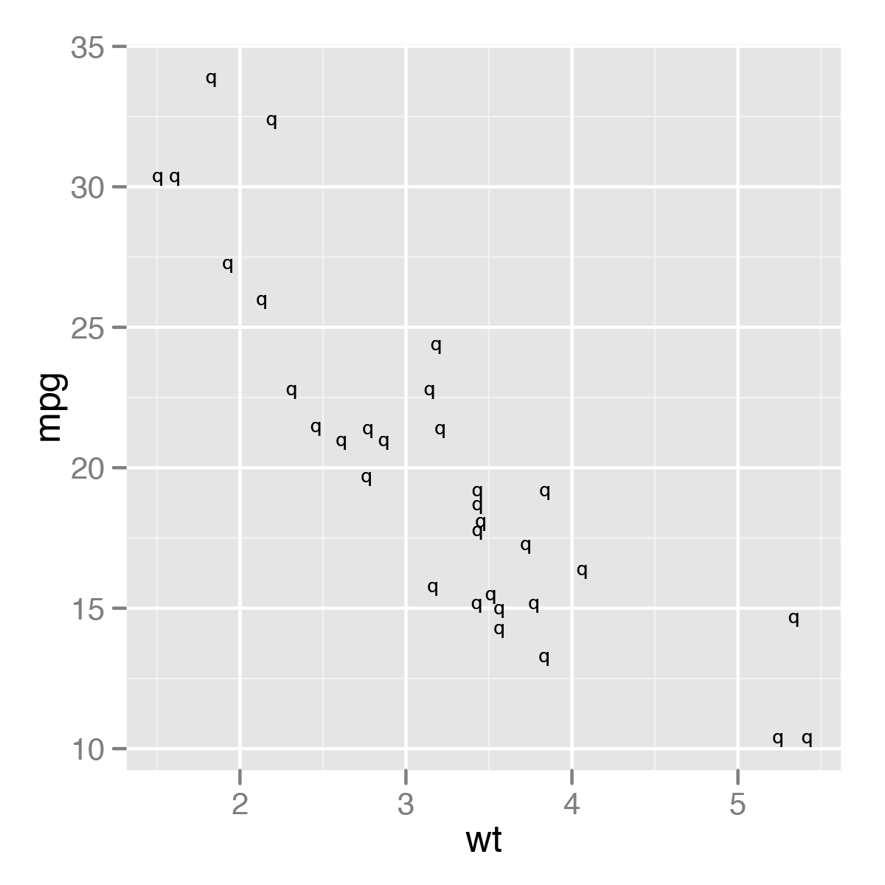
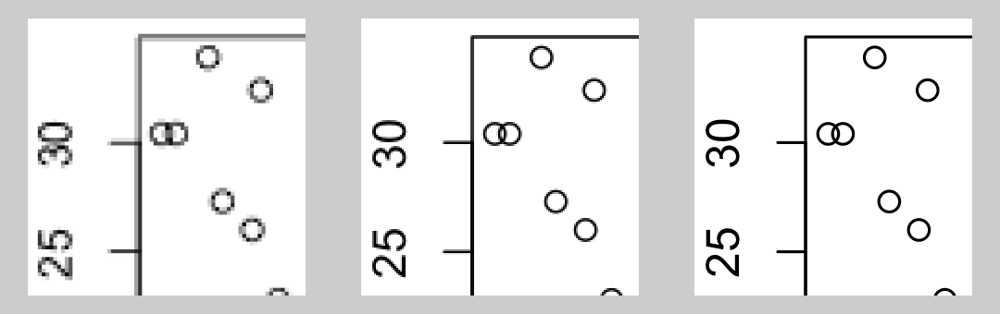
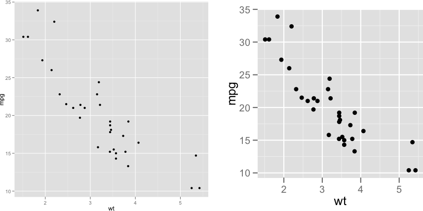
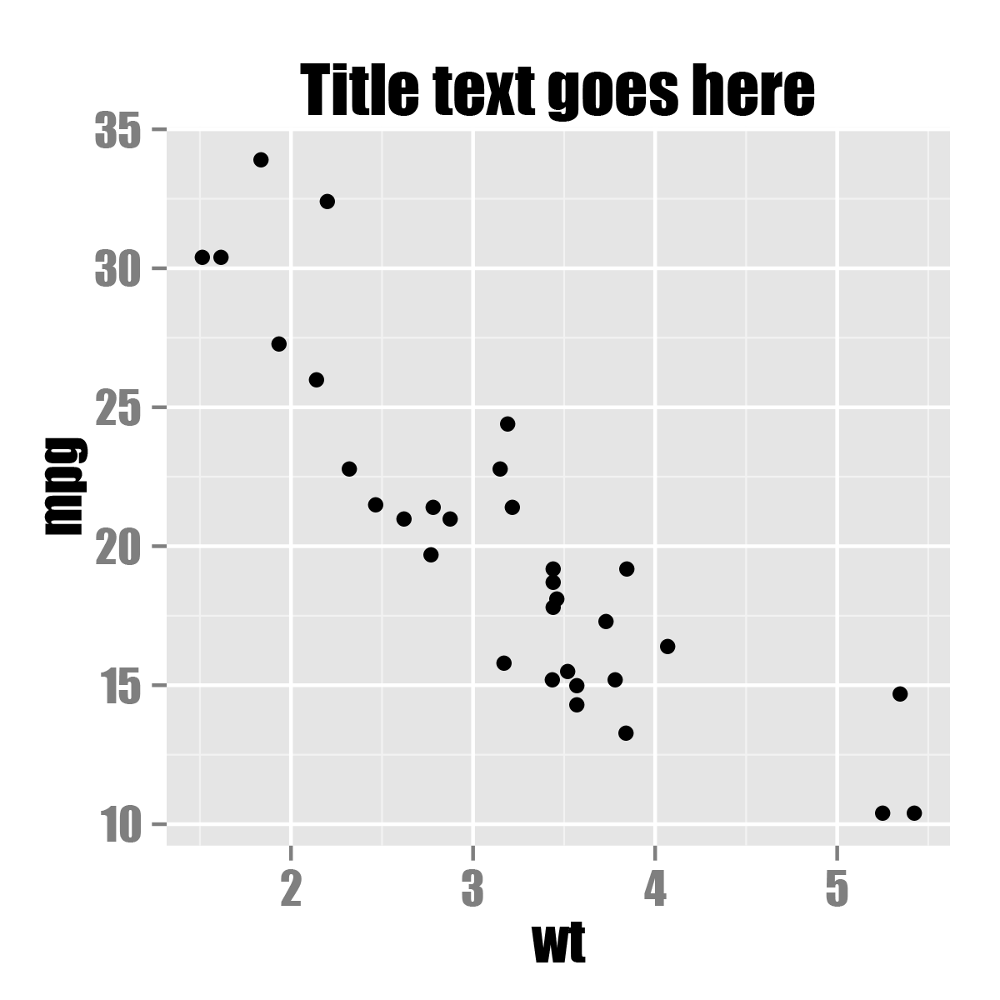
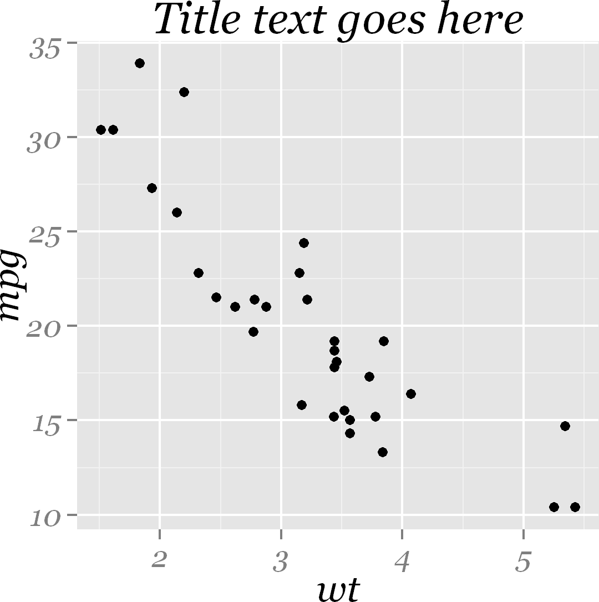

---
output:
  bookdown::html_document2:
    fig_caption: yes
editor_options:
  chunk_output_type: console
---

```{r echo = FALSE, cache = FALSE}
# This block needs cache=FALSE to set fig.width and fig.height, and have those
# persist across cached builds.

source("utils.R", local = TRUE)
knitr::opts_chunk$set(fig.width=3.5, fig.height=3.5)
```


Output for Presentation {#CHAPTER-OUTPUT}
=======================

Broadly speaking, visualizations of data serve two purposes: discovery and communication. In the discovery phase, you'll create exploratory graphics, and when you do this, it's important to be able try out different things quickly. In the communication phase, you'll present your graphics to others. When you do that, you'll need to tweak the appearance of the graphics (which I've written about in previous chapters), and you'll usually need to put them somewhere other than on your computer screen. This chapter is about that last part: *saving* your graphics so that they can be presented in documents.


Outputting to PDF Vector Files {#RECIPE-OUTPUT-VECTOR}
------------------------------

### Problem

You want to create a PDF of your plot.

### Solution

There are two ways to output to PDF files. One method is to open the PDF graphics device with `pdf()`, make the plots, then close the device with `dev.off()`. This method works for most graphics in R, including base graphics and grid-based graphics like those created by ggplot2 and lattice:

```{r eval=FALSE}
# width and height are in inches
pdf("myplot.pdf", width = 4, height = 4)

# Make plots
plot(mtcars$wt, mtcars$mpg)
print(ggplot(mtcars, aes(x = wt, y = mpg)) + geom_point())

dev.off()
```

If you make more than one plot, each one will go on a separate page in the PDF output. Notice that we called `print()` on the ggplot object to make sure that it will generate graphical output even when this code is in a script.

The `width` and `height` are in inches, so to specify the dimensions in centimeters, you must do the conversion manually:

```{r eval=FALSE}
# 8x8 cm
pdf("myplot.pdf", width = 8/2.54, height = 8/2.54)
```

If you are creating plots from a script and it throws an error while creating one, R might not reach the call to `dev.off()`, and could be left in a state where the PDF device is still open. When this happens, the PDF file won't open properly until you manually call `dev.off()`.

If you are creating a plot with ggplot2, using `ggsave()` can be a little simpler. You can store the ggplot object in a variable, and then call `ggsave()` on it:

```{r eval=FALSE}
plot1 <- ggplot(mtcars, aes(x = wt, y = mpg)) +
  geom_point()

# Default is inches, but you can specify unit
ggsave("myplot.pdf", plot1, width = 8, height = 8, units = "cm")
```

Another way of using it is to skip the variable, and just call `ggsave()` after calling `ggplot()`. It will save the last ggplot object:

```{r eval=FALSE}
ggplot(mtcars, aes(x = wt, y = mpg)) +
  geom_point()

ggsave("myplot.pdf", width = 8, height = 8, units = "cm")
```

With `ggsave()`, you don't need to `print()` the ggplot object, and if there is an error while creating or saving the plot, there's no need to manually close the graphic device. `ggsave()` can't be used to make multipage plots, though.

### Discussion

PDF files are usually the best option when your goal is to output to printed documents. They work easily with LaTeX and can be used in presentations with Apple's Keynote, but Microsoft programs may have trouble importing them. (See Recipe \@ref(RECIPE-OUTPUT-VECTOR-WMF) for details on creating vector images that can be imported into Microsoft programs.)

PDF files are also generally smaller than bitmap files such as portable network graphics (PNG) files, because they contain a set of drawing instructions, such as "Draw a line from here to there," instead of information about the color of each pixel. However, there are cases where bitmap files are smaller. For example, if you have a scatter plot that is heavily overplotted, a PDF file can end up much larger than a PNG -- even though most of the points are obscured, the PDF file will still contain instructions for drawing each and every point, whereas a bitmap file will not contain the redundant information. See Recipe \@ref(RECIPE-SCATTER-OVERPLOT) for an example.

### See Also

If you want to manually edit the PDF or SVG file, see Recipe \@ref(RECIPE-OUTPUT-EDIT-VECTOR).


Outputting to SVG Vector Files {#RECIPE-OUTPUT-VECTOR-SVG}
------------------------------

### Problem

You want to create a scalable vector graphics (SVG) image of your plot.

### Solution

Use `svglite()` from the svglite package:

```{r eval=FALSE}
library(svglite)
svglite("myplot.svg", width = 4, height = 4)
plot(...)
dev.off()

# With ggsave()
ggsave("myplot.svg", width = 8, height = 8, units = "cm")
```

### Discussion

Although R has a built-in `svg()` function that can generate SVG output, the svglite package provides more standards-compliant output.

When it comes to importing images, some programs may handle SVG files better than PDFs, and vice versa. For example, web browsers tend to have better SVG support, while document-creation programs like LaTeX tend to have better PDF support.


Outputting to WMF Vector Files {#RECIPE-OUTPUT-VECTOR-WMF}
------------------------------

### Problem

You want to create a Windows metafile (WMF) image of your plot.

### Solution

WMF files can be created and used in much the same way as PDF files -- but they can only be created on Windows:

```{r eval=FALSE}
win.metafile("myplot.wmf", width = 4, height = 4)
plot(...)
dev.off()

# With ggsave()
ggsave("myplot.wmf", width = 8, height = 8, units = "cm")
```

### Discussion

Windows programs such as Microsoft Word and PowerPoint have poor support for importing PDF files, but they natively support WMF. One drawback is that WMF files do not support transparency (alpha).


Editing a Vector Output File {#RECIPE-OUTPUT-EDIT-VECTOR}
----------------------------

### Problem

You want to open a vector output file for final editing.

### Solution

Sometimes you need to make final tweaks to the appearance of a graph for presentation. You can open PDF and SVG files with the excellent free program Inkscape, or with the commercial program Adobe Illustrator.

### Discussion

Font support can be a problem when you open a PDF file with Inkscape. Normally, point objects drawn with the PDF device will be written as symbols from the Zapf Dingbats font. This can be problematic if you want to open the file in an editor like Illustrator or Inkscape; for example, points may appear as the letter *q*, as in Figure \@ref(fig:FIG-OUTPUT-EDIT-VECTOR-DINGBATS), because that is the corresponding letter for a solid bullet in Zapf Dingbats.

```{r FIG-OUTPUT-EDIT-VECTOR-DINGBATS, echo=FALSE, fig.cap="Bad conversion of point symbols after opening in Inkscape -- also notice that the spacing of the fonts is slightly off", fig.width=2.5, fig.height=2.5}

```

To avoid this problem, set `useDingbats = FALSE`. This will make the circles be drawn as circles instead of as font characters:

```{r eval=FALSE}
pdf("myplot.pdf", width = 4, height = 4, useDingbats = FALSE)

# or
ggsave("myplot.pdf", width = 4, height = 4, useDingbats = FALSE)
```

> **Note**
>
> Inkscape might have some issues with fonts as well. You may have noticed that the fonts in Figure \@ref(fig:FIG-OUTPUT-EDIT-VECTOR-DINGBATS) don't look quite right. This is because Inkscape (version 0.48) couldn't find Helvetica, and substituted the font Bitstream Vera Sans instead. A workaround is to copy the Helvetica font file to your personal font library. For example, on Mac OS X, run `cp System/Library/Fonts/Helvetica.dfont ~/Library/Fonts/` from a Terminal window to do this, then, when it says there is a font conflict, click "Ignore Conflict." After this, Inkscape should properly display the Helvetica font.


Outputting to Bitmap (PNG/TIFF) Files {#RECIPE-OUTPUT-BITMAP}
-------------------------------------

### Problem

You want to create a bitmap of your plot, writing to a PNG file.

### Solution

There are two ways to output to PNG bitmap files. One method is to open the PNG graphics device with `png()`, make the plots, then close the device with `dev.off()`. This method works for most graphics in R, including base graphics and grid-based graphics like those created by ggplot2 and lattice:

```{r eval=FALSE}
# width and height are in pixels
png("myplot.png", width = 400, height = 400)

# Make plot
plot(mtcars$wt, mtcars$mpg)

dev.off()
```

For outputting multiple plots, put `%d` in the filename. This will be replaced with 1, 2, 3, and so on, for each subsequent plot:

```{r eval=FALSE}
# width and height are in pixels
png("myplot-%d.png", width = 400, height = 400)

plot(mtcars$wt, mtcars$mpg)
print(ggplot(mtcars, aes(x = wt, y = mpg)) + geom_point())

dev.off()
```

Notice that we called `print()` on the ggplot object to make sure that it will be output even when this code is in a script.

The width and height are in pixels, and the default is to output at 72 pixels per inch (ppi). This resolution is suitable for displaying on a screen, but will look pixelated and jagged in print.

For high-quality print output, use at least 300 ppi. Figure \@ref(fig:FIG-OUTPUT-BITMAP-RES) shows portions of the same plot at different resolutions. In this example, we'll use 300 ppi and create a 4×4-inch PNG file:

```{r eval=FALSE}
ppi <- 300
# Calculate the height and width (in pixels) for a 4x4-inch image at 300 ppi
png("myplot.png", width = 4*ppi, height = 4*ppi, res = ppi)
plot(mtcars$wt, mtcars$mpg)
dev.off()
```

```{r FIG-OUTPUT-BITMAP-RES, echo=FALSE, fig.cap="From left to right: PNG output at 72, 150, and 300 ppi (actual size)", fig.width=3.5}

```

If you are creating plots from a script and it throws an error while creating one, R might not reach the call to `dev.off()`, and could be left in a state where the PNG device is still open. When this happens, the PNG file won't open properly in a viewing program until you manually call `dev.off()`.

If you are creating a plot with ggplot, using `ggsave()` can be a little simpler. It simply saves the last plot created with `ggplot()`. You specify the width and height in inches, not pixels, and tell it how many pixels per inch to use:

```{r eval=FALSE}
ggplot(mtcars, aes(x = wt, y = mpg)) + geom_point()

# Default dimensions are in inches, but you can specify the unit
ggsave("myplot.png", width = 8, height = 8, unit = "cm", dpi = 300)
```

With `ggsave()`, you don't need to print the ggplot object, and if there is an error while creating or saving the plot there's no need to manually close the graphic device.

> **Note**
>
> Although the argument name is `dpi`, it really controls the *pixels* per inch (ppi), not the *dots* per inch. When a grey pixel is rendered in print, it is output with many smaller dots of black ink-and so print output has more dots per inch than pixels per inch.

### Discussion

R supports other bitmap formats, like BMP, TIFF, and JPEG, but there's really not much reason to use them instead of PNG.

The exact appearance of the resulting bitmaps varies from platform to platform. Unlike R's PDF output device, which renders consistently across platforms, the bitmap output devices may render the same plot differently on Windows, Linux, and Mac OS X. There can even be variation within each of these operating systems.

Different platforms will render fonts differently, some platforms will antialias (smooth) lines while others will not, and some platforms support alpha (transparency) while others do not. If your platform lacks support for features like antialiasing and alpha, you can use `CairoPNG()`, from the Cairo package:

```{r eval=FALSE}
install.packages("Cairo")  # One-time installation
CairoPNG("myplot.png")
plot(...)
dev.off()
```

While `CairoPNG()` does not guarantee identical rendering across platforms (fonts may not be exactly the same), it does support features like antialiasing and alpha.

Changing the resolution affects the size (in pixels) of graphical objects like text, lines, and points. For example, a 6-by-6-inch image at 75 ppi has the same pixel dimensions as a 3-by-3-inch image at 150 ppi, but the appearance will be different, as shown in Figure \@ref(fig:FIG-OUTPUT-BITMAP-SIZE). Both of these images are 450×450 pixels. When displayed on a computer screen, they may display at approximately the same size, as they do here.

```{r FIG-OUTPUT-BITMAP-SIZE, echo=FALSE, fig.cap="6×6 inch image at 75 ppi (left); 3×3 inch image at 150 ppi (right)", fig.width=6}

```


Using Fonts in PDF Files {#RECIPE-OUTPUT-FONTS-PDF}
------------------------

### Problem

You want to use fonts other than the basic ones provided by R in a PDF file.

### Solution

The extrafont package can be used to create PDF files with different fonts.

There are a number of steps involved, beginning with some one-time setup. Download and install Ghostscript [http://www.ghostscript.com/download](http://www.ghostscript.com/download), then run the following in R:

```{r eval=FALSE}
install.packages("extrafont")
library(extrafont)

# Find and save information about fonts installed on your system
font_import()

# List the fonts
fonts()
```

After the one-time setup is done, there are tasks you need to do in each R session:

```{r eval=FALSE}
library(extrafont)
# Register the fonts with R
loadfonts()

# On Windows, you may need to tell it where Ghostscript is installed
# (adjust the path to match your installation of Ghostscript)
Sys.setenv(R_GSCMD = "C:/Program Files/gs/gs9.05/bin/gswin32c.exe")
```

Finally, you can create a PDF file and embed fonts into it, as in
Figure \@ref(fig:FIG-OUTPUT-FONTS-PDF):

```{r eval=FALSE}
library(ggplot2)

ggplot(mtcars, aes(x = wt, y = mpg)) + geom_point() +
  ggtitle("Title text goes here") +
  theme(text = element_text(size = 16, family = "Impact"))

ggsave("myplot.pdf", width = 4, height = 4)

embed_fonts("myplot.pdf")
```

```{r FIG-OUTPUT-FONTS-PDF, echo=FALSE, fig.cap="PDF output with embedded font Impact", fig.width=2.5}

```

### Discussion

Fonts can be difficult to work with in R. Some output devices, such as the on-screen quartz device on Mac OS X, can display any font installed on the computer. Other output devices, such as the default png device on Windows, aren't able to display system fonts.

On top of this, PDF files have their own quirks when it comes to fonts. The PDF specification has 14 "core" fonts. These are fonts that every PDF renderer has, and they include standards such as Times, Helvetica, and Courier. If you create a PDF with these fonts, any PDF renderer should display it properly.

If you want to use a font that is *not* one of these core fonts, though, there's no guarantee that the PDF renderer on a given device will have that font, so you can't be sure that the font will display properly on another computer or printer. To solve this problem, non-core fonts can be *embedded* into the PDF; in other words, the PDF file can itself contain a copy of the font you want to use.

If you are putting multiple PDF figures in a PDF document, you may want to embed the fonts in the finished document instead of in each figure. This will make the final document smaller, since it will only have the font embedded once, instead of once for each figure.

Embedding fonts with R can be a tricky process, but the extrafont package handles many of the ugly details for you.

> **Note**
>
> As of this writing, extrafont will only import TrueType (*.ttf*) fonts, but it may support other common formats, such as OpenType (*.otf*), in the future.

### See Also

Showtext is another package for using different fonts in R graphics. It supports TrueType, OpenType, PostScript Type 1 fonts, and makes it easy to download web fonts. However, it currently does not work correctly with the RStudio viewer pane. See <https://cran.r-project.org/web/packages/showtext/vignettes/introduction.html>.

For more on controlling text appearance, see Recipe \@ref(RECIPE-APPEARANCE-TEXT-APPEARANCE).


Using Fonts in Windows Bitmap or Screen Output {#RECIPE-OUTPUT-FONTS-WIN}
----------------------------------------------

### Problem

You are using Windows and want to use fonts other than the basic ones provided by R for bitmap or screen output.

### Solution

The extrafont package can be used to create bitmap or screen output. The procedure is similar to using extrafont with PDF files (Recipe \@ref(RECIPE-OUTPUT-FONTS-PDF)). The one-time setup is almost the same, except that Ghostscript is not required:

```{r eval=FALSE}
install.packages("extrafont")
library(extrafont)

# Find and save information about fonts installed on your system
font_import()

# List the fonts
fonts()
```

After the one-time setup is done, there are tasks you need to do in each R session:

```{r eval=FALSE}
library(extrafont)

# Register the fonts for Windows
loadfonts("win")
```

Finally, you can create each output file or display graphs on screen, as in Figure \@ref(fig:FIG-OUTPUT-FONTS-PNG):

```{r eval=FALSE}
library(ggplot2)

ggplot(mtcars, aes(x = wt, y = mpg)) + geom_point() +
  ggtitle("Title text goes here") +
  theme(text = element_text(size = 16, family = "Georgia", face = "italic"))

ggsave("myplot.png", width = 4, height = 4, dpi = 300)
```

```{r FIG-OUTPUT-FONTS-PNG, echo=FALSE, fig.cap="PNG output with font Georgia Italic", fig.width=2.5}

```

### Discussion

Fonts are handled in a completely different way for bitmaps than they are for PDF files.

On Windows, for bitmap output it is necessary to register each font manually with R (extrafont makes this much easier). On Mac OS X and Linux, the fonts should already be available for bitmap output; it isn't necessary to register them manually.


Combining Several Plots into the Same Graphic  {#RECIPE-COMBINE-GGPLOT}
------------------------------

### Problem

You want to combine several plots into one graphic output.

### Solution

The patchwork package can be used to combine several ggplot2 plots into one graphic. (Figure \@ref(fig:FIG-OUTPUT-PATCHWORK)).

(ref:cap-FIG-OUTPUT-PATCHWORK) Combining two plots together using `patchwork()`

```{r FIG-OUTPUT-PATCHWORK, fig.show="hold", fig.cap="(ref:cap-FIG-OUTPUT-PATCHWORK)", fig.height=3.5, fig.width=7}
library(patchwork)

plot1 <- ggplot(PlantGrowth, aes(x = weight)) +
  geom_histogram(bins = 12)

plot2 <- ggplot(PlantGrowth, aes(x = group, y = weight, group = group)) +
  geom_boxplot()

plot1 + plot2
```

### Discussion

Patchwork also allows you to determine how you want to lay out the ggplots in relation to each other, by adding a `plot_layout()` call. You can use this call to determine the number of columns you want the pplots to be arranged in (Figure \@ref(fig:FIG-OUTPUT-PATCHWORK-COLS)), and the size of the plots (Figure \@ref(fig:FIG-OUTPUT-PATCHWORK-HEIGHT)):

(ref:cap-FIG-OUTPUT-PATCHWORK-COLS) Using `plot_layout()` to specify that the plots should be arranged in 2 columns
```{r FIG-OUTPUT-PATCHWORK-COLS, fig.show="hold", fig.cap="(ref:cap-FIG-OUTPUT-PATCHWORK-COLS)", fig.height=7, fig.width=8}
plot3 <- ggplot(PlantGrowth, aes(x = weight, fill = group)) +
  geom_density(alpha = 0.25)

plot1 + plot2 + plot3 +
  plot_layout(ncol = 2)
```

(ref:cap-FIG-OUTPUT-PATCHWORK-HEIGHT) Using `plot_layout()` to specify the heights of each plot

```{r FIG-OUTPUT-PATCHWORK-HEIGHT, fig.show="hold", fig.cap="(ref:cap-FIG-OUTPUT-PATCHWORK-HEIGHT)"}
plot1 + plot2 +
  plot_layout(ncol = 1, heights = c(1, 4))
```

In the future, patchwork may be available on CRAN, in which case it can be installed using the usual `install.packages()`.

### See Also

For more on additional patchwork features, see <https://github.com/thomasp85/patchwork>.
