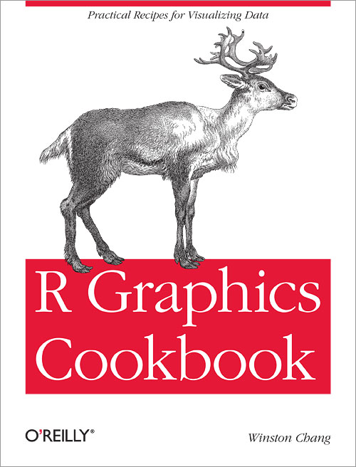

# Welcome {-}

Welcome to the **R Graphics Cookbook**, a practical guide that provides more than 150 recipes to help you generate high-quality graphs quickly, without having to comb through all the details of R’s graphing systems. Each recipe tackles a specific problem with a solution you can apply to your own project, and includes a discussion of how and why the recipe works.

Read online here for free, or buy a physical copy on [Amazon](https://www.amazon.com/dp/1491978600).
